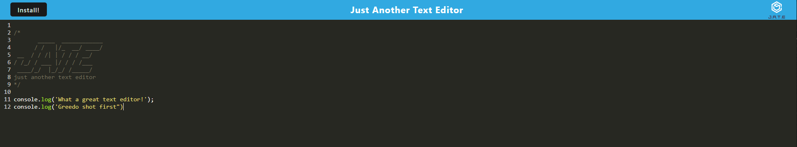
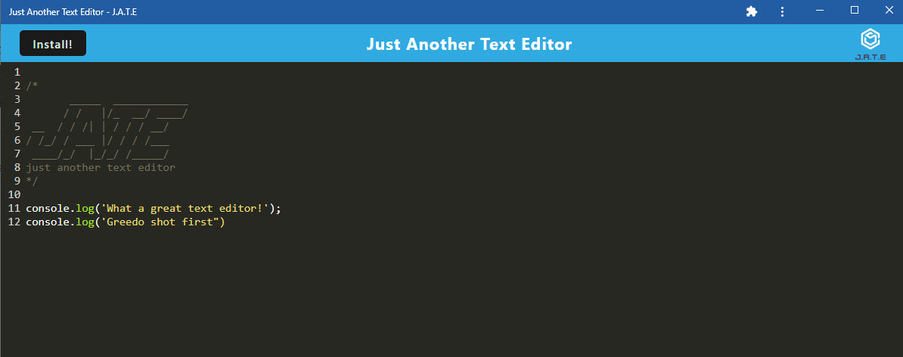
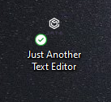

# Text-Editor-PWA-

## Description
This application is a web text editor.  This application is designed and set up to be used as a PWA (Progressive Web Application).  You can enter any notes, code, or thoughts.  The content is saved in local storage as well as indexDB so that it can accessed while offline.  The install button at the top of the page will set up the application as a PWA and prompt the user to install the application.  Once the brower and PWA have been closed, the content of the editor remains on the page.

## User Story

```md
AS A developer
I WANT to create notes or code snippets with or without an internet connection
SO THAT I can reliably retrieve them for later use
```


## Acceptance Criteria
```md
GIVEN a text editor web application
WHEN I open my application in my editor
THEN I should see a client server folder structure
WHEN I run `npm run start` from the root directory
THEN I find that my application should start up the backend and serve the client
WHEN I run the text editor application from my terminal
THEN I find that my JavaScript files have been bundled using webpack
WHEN I run my webpack plugins
THEN I find that I have a generated HTML file, service worker, and a manifest file
WHEN I use next-gen JavaScript in my application
THEN I find that the text editor still functions in the browser without errors
WHEN I open the text editor
THEN I find that IndexedDB has immediately created a database storage
WHEN I enter content and subsequently click off of the DOM window
THEN I find that the content in the text editor has been saved with IndexedDB
WHEN I reopen the text editor after closing it
THEN I find that the content in the text editor has been retrieved from our IndexedDB
WHEN I click on the Install button
THEN I download my web application as an icon on my desktop
WHEN I load my web application
THEN I should have a registered service worker using workbox
WHEN I register a service worker
THEN I should have my static assets pre cached upon loading along with subsequent pages and static assets
WHEN I deploy to Heroku
THEN I should have proper build scripts for a webpack application
```


## Technologies
This application uses webpack for script and style sheet bundling.  IndexBD is used for offline data storage.  It uses babel, webpack's pwa-manifest, and the workbox webpack plug-in for the service worker.  All the script is written in JavaScript, and the rest of the front end uses HTML and CSS.

## Review
To review the code, please go to the [Repository](https://github.com/jstndhouk/Text-Editor-PWA-).

## Deploy
The application is deployed to Heroku and can be found [Here](https://just-another-text-editor-jh.herokuapp.com/).

## Screenshots
See below screenshots of different aspects of the application:






